## :dart: About

This is an eCommerce Application developed using FlutterFire (Flutter+Firebase). I have tried to collect all the basic features of any eCommerce App into this application (illustrations included in repository). It uses Flutter Framework for App Frontend and Backend, and Firebase as server maintaining Databases and Storage requirments of the app. It uses Firebase Authentification, Firebase Cloud Firestore, Firebase Storage. Try out the APK given in Installation section!!!

NOTE: Its tries to stimulate a mock buy-sell cycle as their is no any Payment Gateway added in this app.

## :sparkles: Features

:heavy_check_mark: User Authentification and related services\
:heavy_check_mark: Add your Products\
:heavy_check_mark: View products added by other users\
:heavy_check_mark: View products of Different Cateogories\
:heavy_check_mark: Maintain Cart\
:heavy_check_mark: Mark products as your favourites\
:heavy_check_mark: Manage your Addresses\
:heavy_check_mark: Review the products you buy

## :checkered_flag: Illustrations

Here are some Illustration of App Screens

| 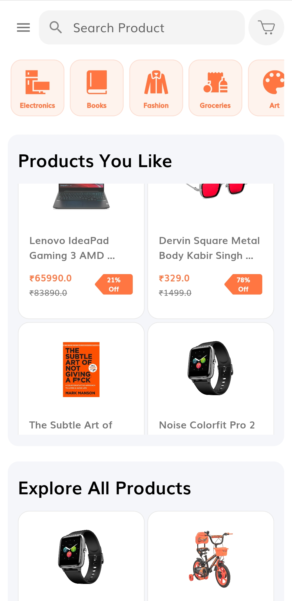 | 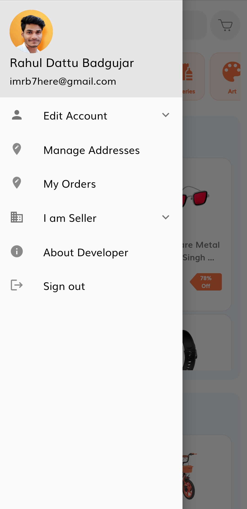 | 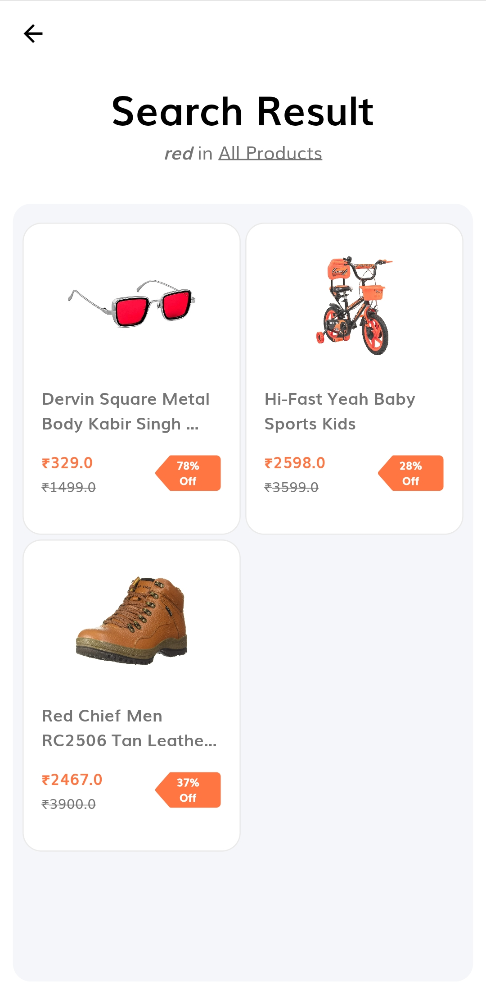 |
| :--------------------------------: | :---------------------------------------: | :----------------------------------: |
|            Home Screen             |            Home Screen Drawer             |            Search Result             |

| 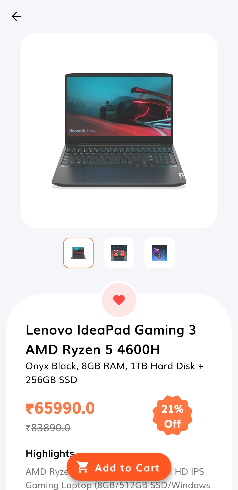 | 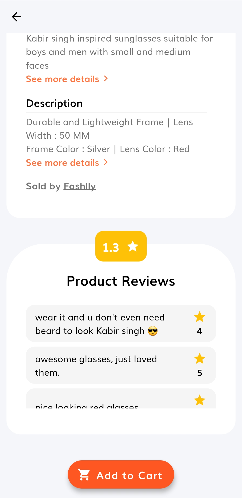 | 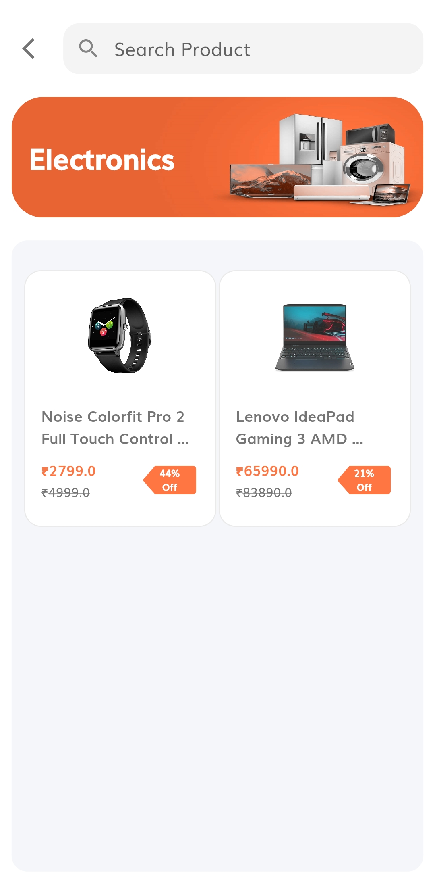 |
| :--------------------------------------: | :--------------------------------------: | :-------------------------------------: |
|        Product Details Screen - 1        |        Product Details Screen - 2        |        Category Products Screen         |

| 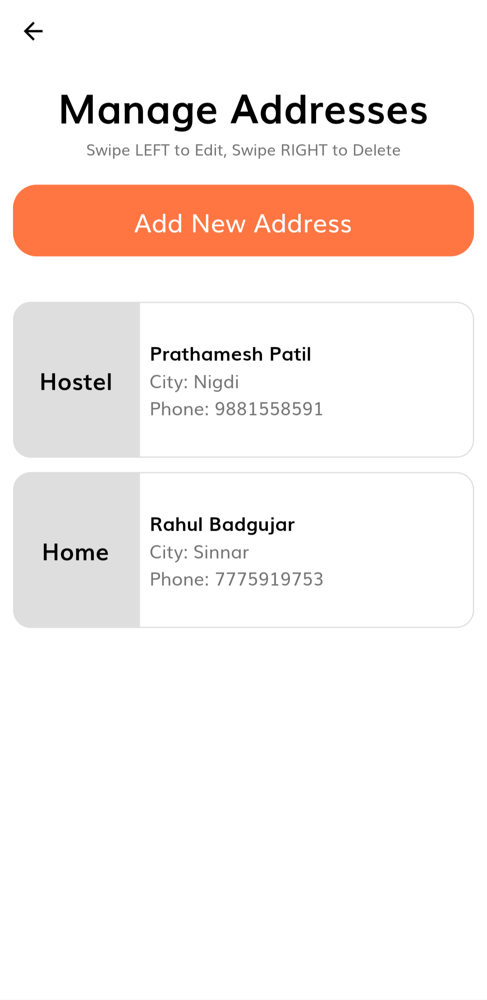 | 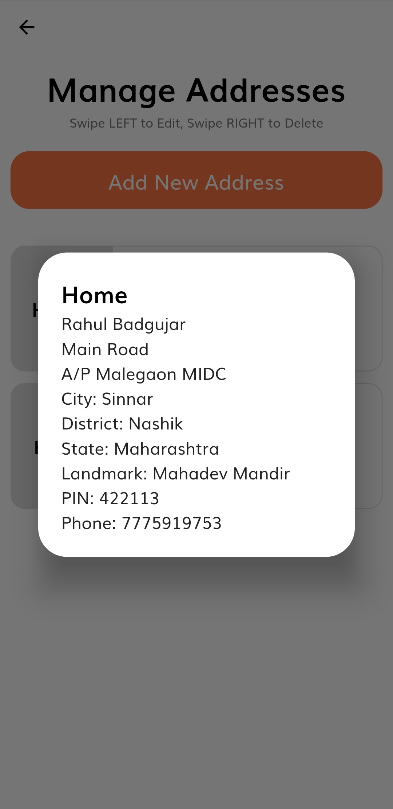 | 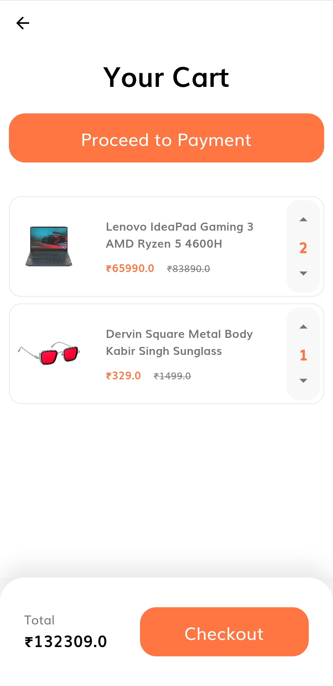 |
| :-------------------------------------: | :-----------------------------------: | :-------------------------: |
|         Manage Addresses Screen         |            Address Dialog             |         Cart Screen         |

| 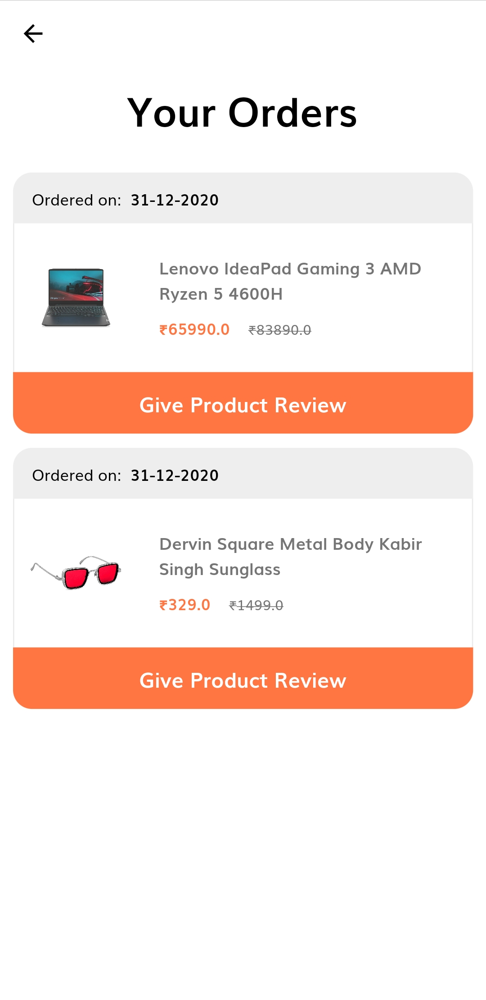 | 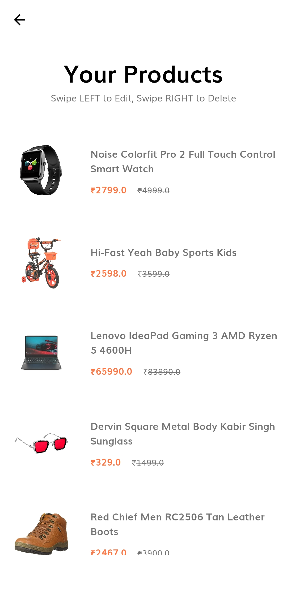 | 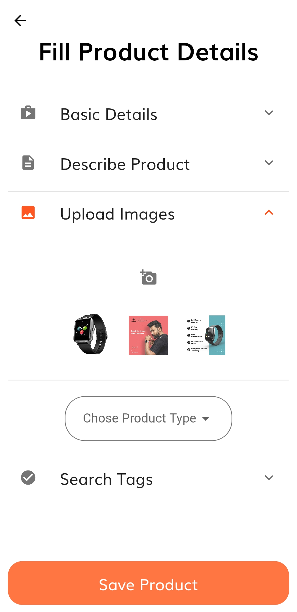 |
| :------------------------------: | :--------------------------------: | :---------------------------------: |
|         My Orders Screen         |         My Products Screen         |     Add or Edit Product Screen      |

| 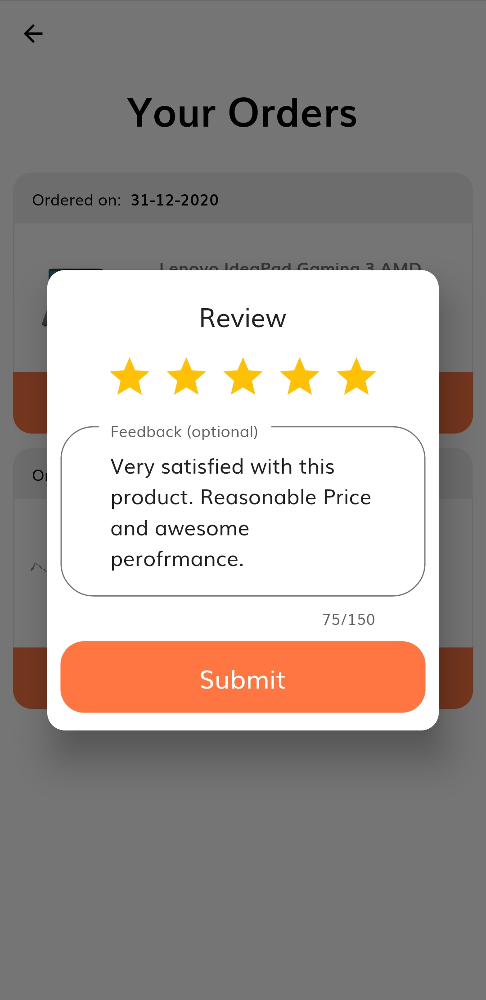 | 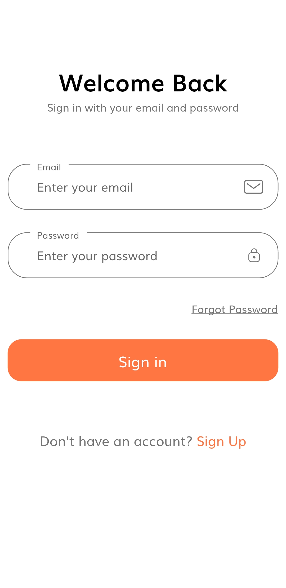 | 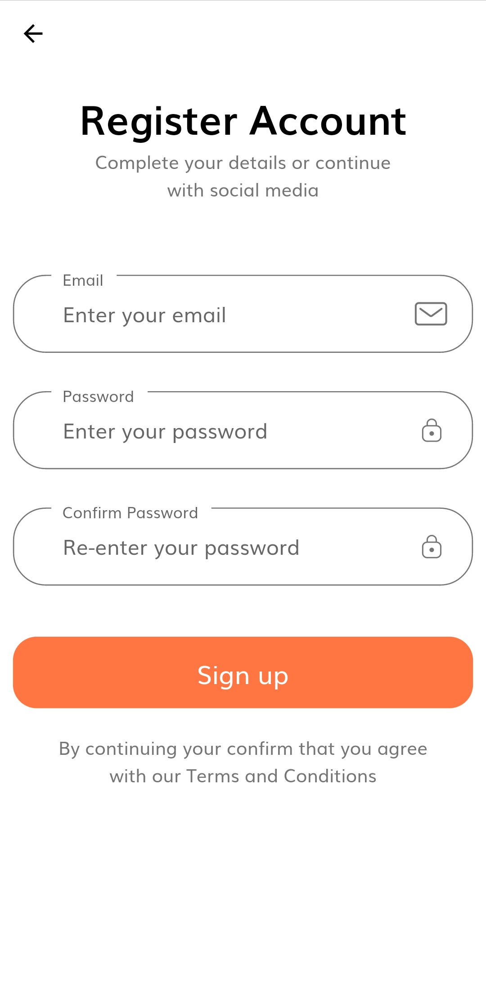 |
| :----------------------------------: | :----------------------------: | :----------------------------: |
|        Product Review Dialog         |         Sign In Screen         |         Sign Up Screen         |

| 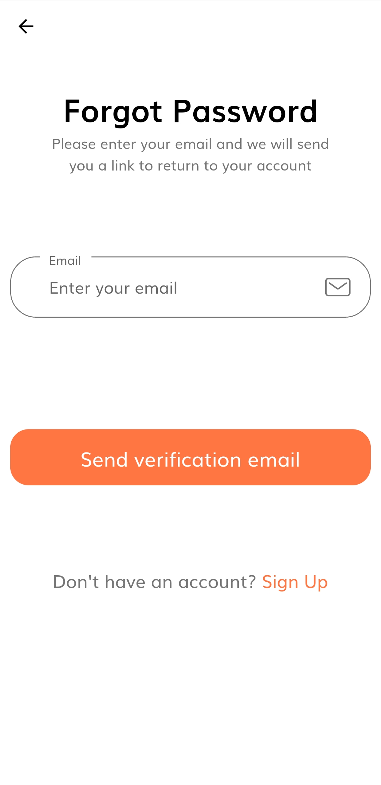 | 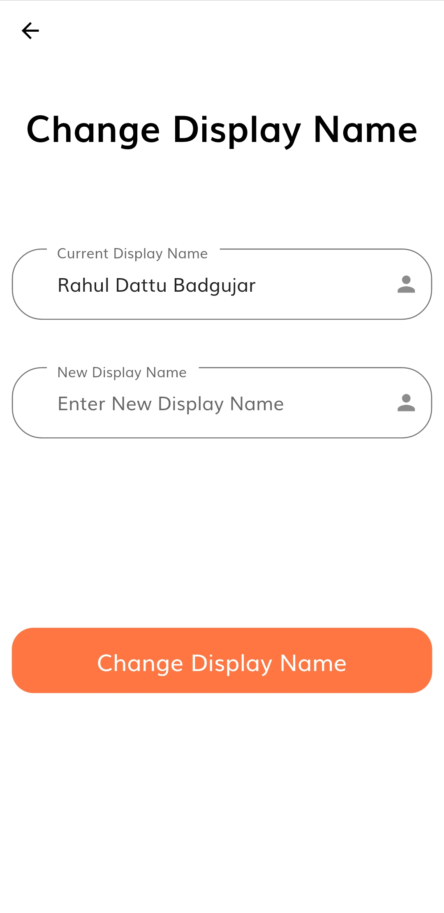 |  |
| :------------------------------------: | :----------------------------------------: | :-------------------------------------------: |
|         Forgot Password Screen         |         Change Display Name Screen         |         Change Display Picture Screen         |

|  | 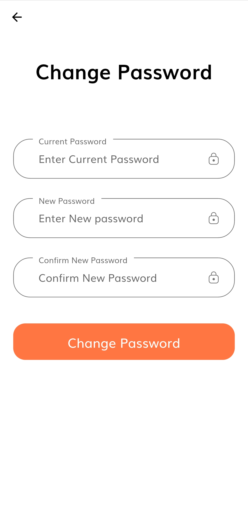 | 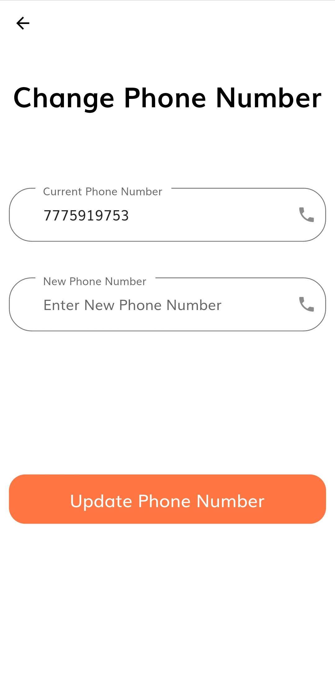 |
| :---------------------------------: | :------------------------------------: | :---------------------------------: |
|         Change Email Screen         |         Change Password Screen         |         Change Phone Screen         |

And all rest at [more screens](illustrations/)